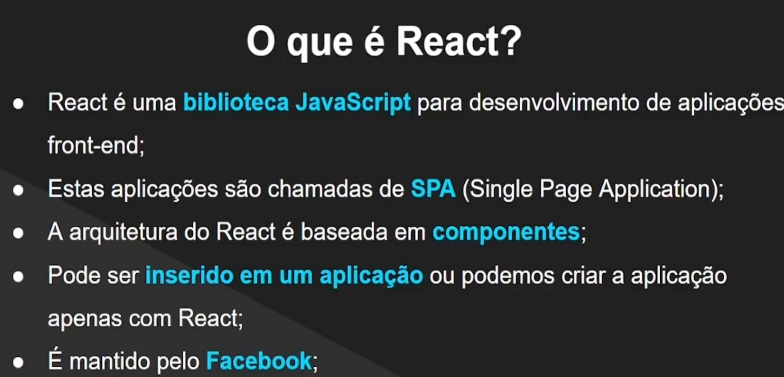

# React do Zero a Maestria (c/ hooks, router, API, Projetos)

https://www.udemy.com/course/react-do-zero-a-maestria-c-hooks-router-api-projetos/

## <a name="indice">Índice</a>

1. [Seção 01: Introdução](#parte1)
2. [Seção 02: Fundamentos do React](#parte2)
3. [Seção 03: Avançando em React](#parte3)
4. [Seção 04: React e CSS](#parte4)
5. [Seção 05: Formulários com React](#parte5)
6. [Seção 06: Projeto: Secret Word](#parte6)
7. [Seção 07: Requisições HTTP com React](#parte7)
8. [Seção 08: React Router](#parte8)
9. [Seção 09: Context API do React](#parte9)
10. [Seção 10: Projeto: MiniBlog (React Router, Hooks, Context, Firebase, Autenticação)](#parte10)
11. [Seção 11: Entenda os hooks do React](#parte11)
12. [Seção 12: Projeto ReactGram (React, Redux, Express, MongoDB, Mongoose e mais)](#parte12)
13. [Seção 13: Deploy de projetos em React](#parte13)
14. [Seção 14: Apêndice A: JavaScript Moderno](#parte14)
15. [Seção 15: Apêndice B: Introdução a APIs](#parte15)
16. [Seção 16: Apêndice C: Setup do TypeScript](#parte16)
17. [Seção 17: Apêndice D: React com TypeScript](#parte17)
18. [Seção 18: Apêndice E: Projeto de React com TypeScript](#parte18)
19. [Seção 19: Apêndice F: Projeto em React com a API do TMDB](#parte19)
20. [Seção 20: Conclusão e próximos passos](#parte20)
---


## <a name="parte1">1 - Seção 01: Introdução</a>

### 1. Introdução do curso
### 2. Apresentação do curso
### 3. O que é React?



### 4. O que é Node.js?

Node.js é um ambiente de execução de código JavaScript no lado do servidor. Foi criado em 2009 por Ryan Dahl, e desde então, revolucionou a forma como os desenvolvedores constroem aplicações web, especialmente no back-end. Node.js é baseado no motor JavaScript V8, o mesmo usado pelo Google Chrome, o que o torna extremamente rápido e eficiente.

### Principais Características do Node.js

- **Event-driven**: O Node.js é baseado em um modelo de programação orientado a eventos, o que permite a criação de aplicações assíncronas e não bloqueantes. Isso significa que ele pode lidar com muitas conexões simultâneas de forma eficiente.
- **Non-blocking I/O**: As operações de entrada/saída em Node.js são não bloqueantes, o que significa que uma operação não impede que outras sejam executadas simultaneamente. Isso é essencial para a construção de aplicações escaláveis.
- **Single-threaded**: Embora o Node.js seja single-threaded, ele pode gerenciar várias operações simultâneas através do uso de callbacks, promessas e async/await. Ele utiliza um loop de eventos para gerenciar essas operações.
- **NPM (Node Package Manager)**: O NPM é o gerenciador de pacotes padrão para o Node.js, e oferece acesso a milhares de pacotes de código aberto que podem ser facilmente integrados em suas aplicações.
- **Cross-platform**: Node.js é multiplataforma, o que significa que pode ser executado em diferentes sistemas operacionais como Windows, macOS e Linux.

### Aplicações do Node.js

- **Aplicações Web em Tempo Real**: Devido à sua capacidade de gerenciar múltiplas conexões simultâneas de forma eficiente, Node.js é amplamente utilizado para construir aplicações em tempo real, como chats, jogos multiplayer e sistemas de notificação.
- **APIs RESTful**: Node.js é uma excelente escolha para criar APIs RESTful devido à sua natureza assíncrona e capacidade de lidar com operações de E/S de forma rápida.
- **Aplicações de Streaming**: Plataformas de streaming de vídeo e áudio se beneficiam do Node.js por causa de sua eficiência na manipulação de dados em fluxo contínuo.
- **Aplicações de IoT (Internet das Coisas)**: A arquitetura leve e eficiente do Node.js o torna ideal para construir aplicações de IoT que exigem respostas rápidas e suporte para múltiplos dispositivos conectados.
- **Ferramentas de Desenvolvimento**: Muitos desenvolvedores utilizam Node.js para criar ferramentas de linha de comando e scripts automatizados que auxiliam no desenvolvimento e deploy de aplicações.

Node.js tem se tornado uma escolha popular para desenvolvedores por sua eficiência, escalabilidade e pela vasta comunidade de apoio. 

FONTE: COPILOT

### 5. O que é npm?

NPM, ou Node Package Manager, é o gerenciador de pacotes padrão para o ambiente de execução Node.js. Ele facilita a instalação, atualização e gerenciamento de bibliotecas e dependências de terceiros que podem ser usadas em projetos Node.js. NPM é uma ferramenta poderosa que oferece acesso a um repositório vasto de pacotes de código aberto, permitindo que os desenvolvedores compartilhem e reutilizem código com facilidade.

### Principais Características do NPM

- **Gerenciamento de Pacotes**: NPM permite que os desenvolvedores instalem, atualizem, e removam pacotes de software com simples comandos de linha de comando. Ele também lida com a resolução de dependências entre pacotes.
- **Repositório Centralizado**: NPM possui um repositório online onde milhões de pacotes estão disponíveis para download. Esse repositório é mantido pela comunidade e é constantemente atualizado com novos pacotes e versões.
- **Scripts NPM**: Os desenvolvedores podem definir scripts personalizados no arquivo `package.json` para automatizar tarefas comuns, como testes, build e deploy de suas aplicações.
- **Controle de Versão**: NPM permite que os desenvolvedores especifiquem quais versões de pacotes são necessárias para seus projetos, garantindo que o ambiente de desenvolvimento e produção sejam consistentes.
- **Gestão de Dependências**: NPM mantém um arquivo `package-lock.json` que registra as versões exatas dos pacotes instalados, garantindo que todas as instalações futuras tenham as mesmas dependências.

### Aplicações do NPM

- **Instalação de Bibliotecas**: NPM é amplamente utilizado para instalar bibliotecas de terceiros que adicionam funcionalidades às aplicações Node.js. Por exemplo, frameworks como Express para construção de servidores web ou Mongoose para trabalhar com MongoDB.
- **Automação de Tarefas**: Os scripts NPM são usados para automatizar tarefas de desenvolvimento, como minificação de arquivos, execução de testes unitários e linting de código.
- **Compartilhamento de Código**: Os desenvolvedores podem publicar seus próprios pacotes no repositório NPM, facilitando o compartilhamento de código com a comunidade global.
- **Gerenciamento de Monorepos**: NPM é frequentemente utilizado em projetos monorepo para gerenciar múltiplos pacotes dentro de um único repositório, facilitando o desenvolvimento e a manutenção de grandes bases de código.
- **Integração Contínua (CI/CD)**: Ferramentas de CI/CD usam NPM para instalar dependências e executar scripts de build e deploy como parte do processo de entrega contínua de software.

NPM é uma ferramenta essencial no ecossistema Node.js, tornando o desenvolvimento de aplicações mais eficiente e colaborativo. 

FONTE: COPILOT

### 6. Instalação do Node.js no Windows
### 7. Instalação do Node.js no Linux
### 8. Instalação do VS Code
### 9. Hello World em React

*UPDATE* -> https://www.youtube.com/watch?v=ERflhpiMc1o

[Secao01-Introducao/hello-word](Secao01-Introducao/hello-word)

```
 $ npx create-vite .
Need to install the following packages:
create-vite@6.1.1
Ok to proceed? (y) y

✔ Select a framework: › React
✔ Select a variant: › JavaScript

Scaffolding project in /home/josemalcher/workspaces/React_do_Zero_a_Maestria-c-hooks-router-API-Projetos/Secao01-Introducao/proj_exemplo2...

Done. Now run:

  npm install
  npm run dev

----------------------------------------------------------------------------------------------------------------------------------------------------------------------------------------------------------------------------------------------------
 $ npm i                   
```

[Secao01-Introducao/proj_exemplo2](Secao01-Introducao/proj_exemplo2)

### 10. Criação de projetos com Vite
### 11. Estrutura inicial do React
### 12. Extensão para React no VS Code
### 13. Configurando o Emmet para o React
### 14. Como tirar o melhor proveito deste curso
### 15. Repositório do curso
### 16. Slides do curso
### Tarefa 1: Praticando React
### 17. Indicações de Livros
### 18. Aviso importante sobre componentes do React JS
### 19. Como utilizar o Prettier no Visual Studio Code
### 20. Conclusão da seção
### 21. Como aprender programação mais rápido e ter sucesso na carreira
### 22. Teste para saber sua dificuldade com programação

[Voltar ao Índice](#indice)

---


## <a name="parte2">2 - Seção 02: Fundamentos do React</a>


[Voltar ao Índice](#indice)

---


## <a name="parte3">3 - Seção 03: Avançando em React</a>


[Voltar ao Índice](#indice)

---


## <a name="parte4">4 - Seção 04: React e CSS</a>


[Voltar ao Índice](#indice)

---


## <a name="parte5">5 - Seção 05: Formulários com React</a>


[Voltar ao Índice](#indice)

---


## <a name="parte6">6 - Seção 06: Projeto: Secret Word</a>


[Voltar ao Índice](#indice)

---


## <a name="parte7">7 - Seção 07: Requisições HTTP com React</a>


[Voltar ao Índice](#indice)

---


## <a name="parte8">8 - Seção 08: React Router</a>


[Voltar ao Índice](#indice)

---


## <a name="parte9">9 - Seção 09: Context API do React</a>


[Voltar ao Índice](#indice)

---


## <a name="parte10">10 - Seção 10: Projeto: MiniBlog (React Router, Hooks, Context, Firebase, Autenticação)</a>


[Voltar ao Índice](#indice)

---


## <a name="parte11">11 - Seção 11: Entenda os hooks do React</a>


[Voltar ao Índice](#indice)

---


## <a name="parte12">12 - Seção 12: Projeto ReactGram (React, Redux, Express, MongoDB, Mongoose e mais)</a>


[Voltar ao Índice](#indice)

---


## <a name="parte13">13 - Seção 13: Deploy de projetos em React</a>


[Voltar ao Índice](#indice)

---


## <a name="parte14">14 - Seção 14: Apêndice A: JavaScript Moderno</a>


[Voltar ao Índice](#indice)

---


## <a name="parte15">15 - Seção 15: Apêndice B: Introdução a APIs</a>


[Voltar ao Índice](#indice)

---


## <a name="parte16">16 - Seção 16: Apêndice C: Setup do TypeScript</a>


[Voltar ao Índice](#indice)

---


## <a name="parte17">17 - Seção 17: Apêndice D: React com TypeScript</a>


[Voltar ao Índice](#indice)

---


## <a name="parte18">18 - Seção 18: Apêndice E: Projeto de React com TypeScript</a>


[Voltar ao Índice](#indice)

---


## <a name="parte19">19 - Seção 19: Apêndice F: Projeto em React com a API do TMDB</a>


[Voltar ao Índice](#indice)

---


## <a name="parte20">20 - Seção 20: Conclusão e próximos passos</a>


[Voltar ao Índice](#indice)

---
